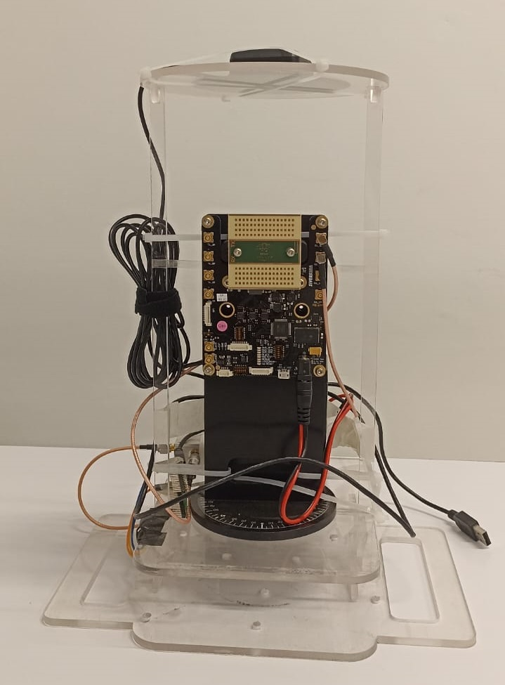
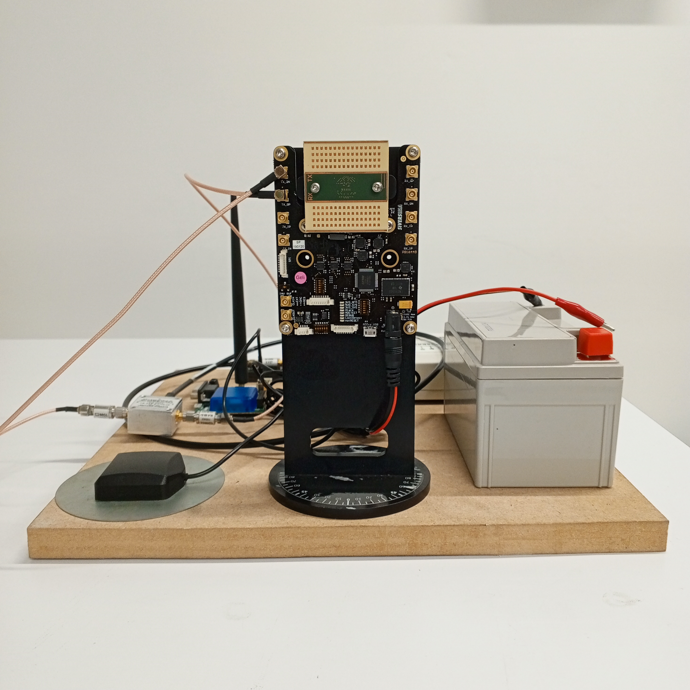

# 5G path loss characterization at 60GHz

5G path loss characterization using SIVERS Semiconductors EVK 6002 transceivers and USRP B200mini (60 GHz) for outdoor environments. Realized in the context of the course "Wireless Communications" at the Universidad Nacional de Colombia (UNAL) - Bogotá DC. Data are taken in the greenhouses of the university campus.

Develop by:

- Julian Andres Castro Pardo &emsp;&emsp;&emsp;(<juacastropa@unal.edu.co>)
- Diana Sofía López &emsp;&emsp;&emsp;&emsp;&emsp;&emsp;&emsp;(<dialopez@unal.edu.co>)
- Carlos Julian Furnieles Chipagra &emsp; (<cfurniles@unal.edu.co>)

The project is based on the following steps:

- [Experimental setup](#experimental-setup)
- [Data acquisition](#data-acquisition)
- [Data analysis and visualization](#data-analysis-and-visualization)
- [Pathloss model comparison and validation](#pathloss-model-comparison-and-validation)

## Experimental setup

- Instruments
  - USRP's B200, B200mini ([Ettus](https://www.ettus.com/all-products/usrp-b200mini-i-2/))
  - Kit Transceivers EVK 6002 (60 GHz) ([SIVERS Semiconductors](https://www.sivers-semiconductors.com/5g-millimeter-wave-mmwave-and-satcom/wireless-products/evaluation-kits/evaluation-kit-evk06002/))
  - GPS RTK Modules C94-M8P-2 ([Ublox](https://www.u-blox.com/en/product/c94-m8p))
  - Raspberry Pi Pico (RP2040) ([Raspberry](https://www.raspberrypi.com/products/raspberry-pi-pico/))
  - Accelerometer/Magnetometer (LSM303DLHC) ([Adafruit](https://learn.adafruit.com/lsm303-accelerometer-slash-compass-breakout/coding))
  - Splitter 1x2 ZFSCJ-2-232-S+ (5-2300 MHz) ([Minicircuits](https://www.minicircuits.com/WebStore/dashboard.html?model=ZFSCJ-2-232-S%2B))
  - DC-blocks $50\Omega$ BLK-89-S+ Type connector: SMA. (0 -8GHz) ([Minicircuits](https://www.minicircuits.com/WebStore/dashboard.html?model=BLK-89-S%2B))

- Software (Windows OS)
  - GNU Radio for Windows (Python 3.11) ([GitHub](https://wiki.gnuradio.org/index.php/InstallingGR))
  - USRP UHD Version: 4.6.0.0-release ([Ettus Research](https://files.ettus.com/binaries/uhd_stable/uhd_004.006.000.000-release/4.6.0.0/))
  - U-center ([Ublox](https://www.u-blox.com/en/product/u-center))
  - SIVERS GUI for EVK 6002 (Python 3.9 based) ([SIVERS Semiconductors](https://www.sivers-semiconductors.com/5g-millimeter-wave-mmwave-and-satcom/wireless-products/evaluation-kits/evaluation-kit-evk06002/))

- #### *[Configuration and install](/Docs/Install_UHD_GNURadio.md) software and modules Python on Windows OS* [▶️](/Docs/Install_UHD_GNURadio.md)

  ### Hardware and software architecture

  |  |
  |:--:|
  | *Wireless hardware setup block diagram* |

   

  |  |
  |:--:|
  | *Wireless software UML diagram* |

  <table>
  <tr>
    <td style="text-align: center;">
      
      
<i>Rover Rx</i>

    </td>
    <td style="text-align: center;">
      
      
<i>Base Station Tx</i>

    </td>
  </tr>
  </table>

## Data acquisition [:top:](#5g-path-loss-characterization-at-60ghz)

### Configuration of modules and sensors

- Raspberry Pi Pico
- GPS RTK Modules C94-M8P-2
- Transceivers *Sivers EVK6002 ~60GHZ*

## Data analysis and visualization

## Pathloss model comparison and validation

## References
